<h1 align="center">
    
</h1>

  <a href="#-projeto">Projeto</a>&nbsp;&nbsp;&nbsp;|&nbsp;&nbsp;&nbsp;
  <a href="#-tecnologias">Tecnologias</a>&nbsp;&nbsp;&nbsp;|&nbsp;&nbsp;&nbsp;
  <a href="#-layout">Layout</a>&nbsp;&nbsp;&nbsp;|&nbsp;&nbsp;&nbsp;
  <a href="#-to-do">Como contribuir</a>&nbsp;&nbsp;&nbsp;|&nbsp;&nbsp;&nbsp;
  <a href="#-projeto-final">Projeto final</a>

 

  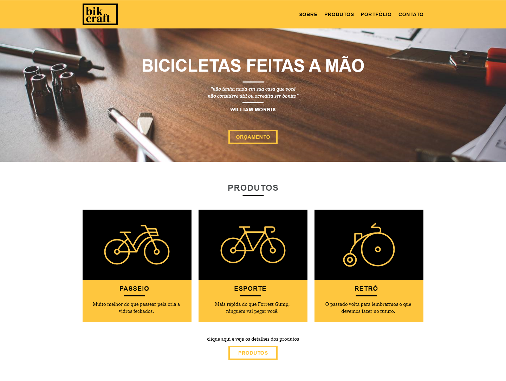

## 💻 Projeto

A Bikcraft é uma empresa fictícia que trabalha com a personalização de bicicletas, cujo objetivo era o de aumentar seu faturamento por meio de um website, divulgando seus produtos para novos clientes.

## 🚀 Tecnologias

Esse projeto foi desenvolvido com as seguintes tecnologias:

- [HTML5](https://developer.mozilla.org/pt-BR/docs/Web/HTML)
- [CSS3](https://developer.mozilla.org/pt-BR/docs/Web/CSS)
- [JavaScript](https://developer.mozilla.org/pt-BR/docs/Web/JavaScript) (animações e slides)
- [PHPMailer](https://github.com/PHPMailer/PHPMailer) e [SendGrid](https://sendgrid.com/) (back-end para envio de formulários)

## 🔖 Layout

O layout do site foi desenvolvido durante o curso de **Web Design Completo** da [Origamid](https://www.origamid.com/curso/web-design-completo/).

## 📝 TO DO

- [ ] Implementar o sistema de blog com o CMS (Wordpress)
- [ ] Aplicar os conhecimentos de Grid Display e Flex Box

## 🌐 Projeto final
[Clique aqui](https://vilsonsampaio.github.io/bikcraft/) para acessar o projeto no ar!

### 🖥 Desktop

#### Home
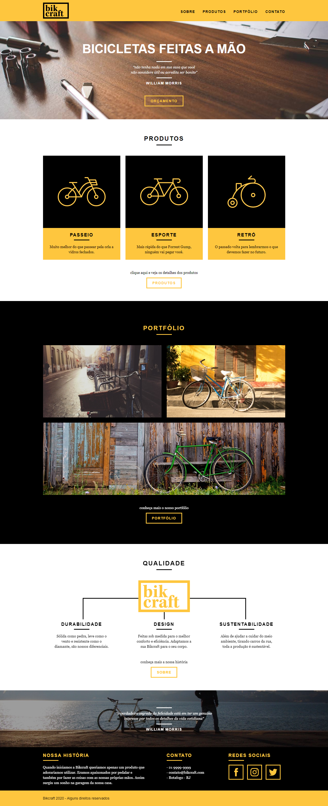

#### Sobre
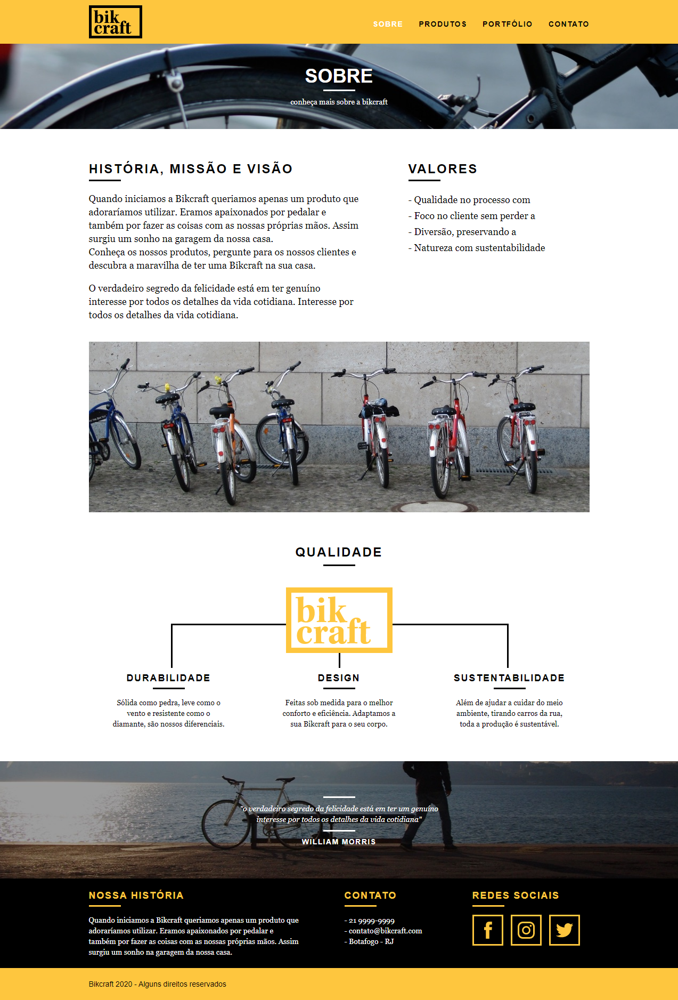

#### Produtos
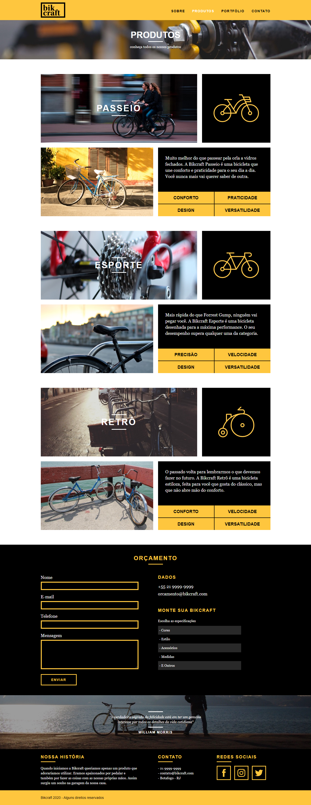

#### Portfólio
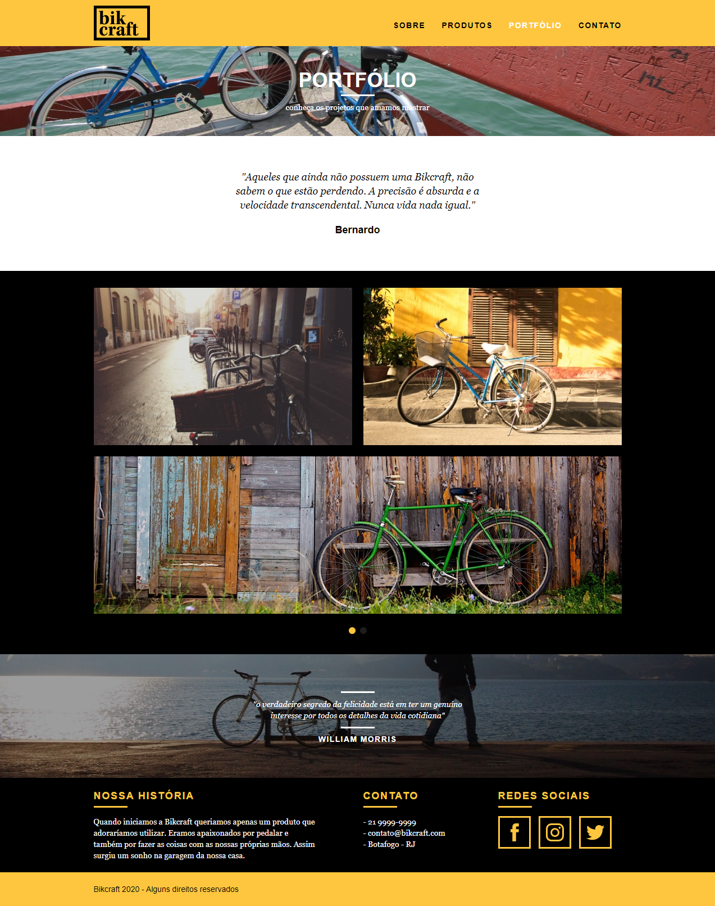

#### Contato
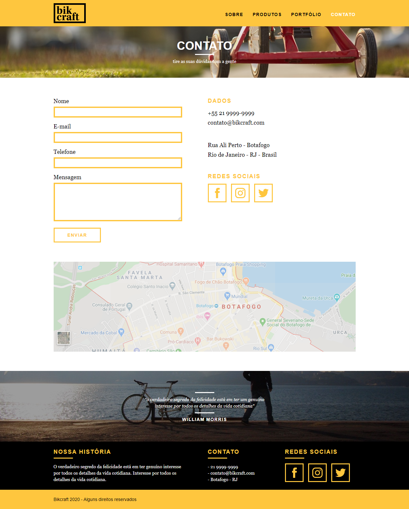

### 📱 Mobile

#### Home
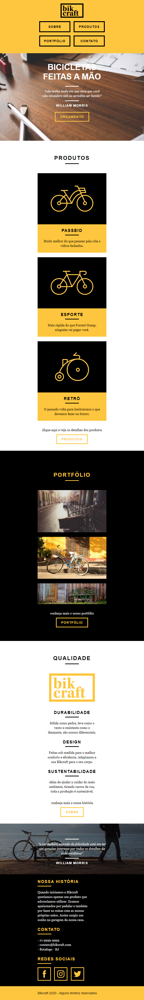

#### Sobre
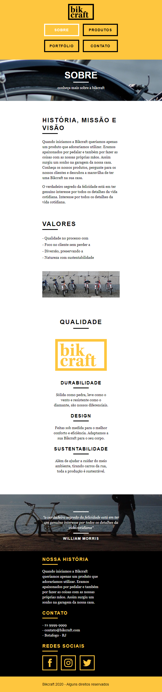

#### Produtos
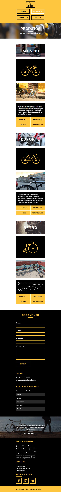

#### Portfólio
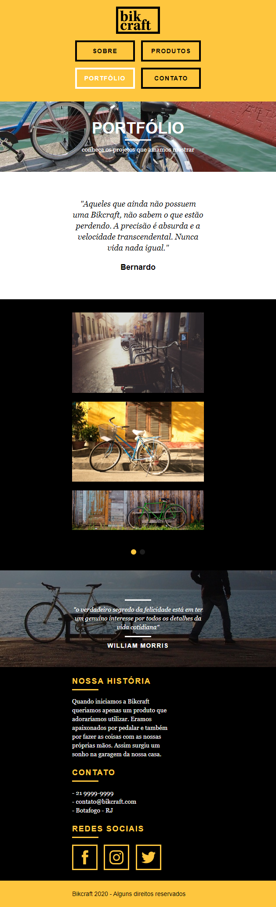

#### Contato
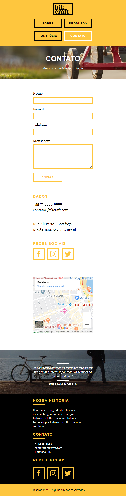

---

Feito com ❤️ <a href="https://www.linkedin.com/in/vilsonsampaio/">Vilson Sampaio</a>

