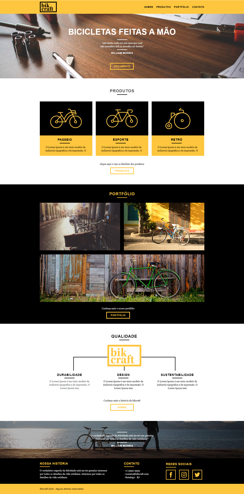
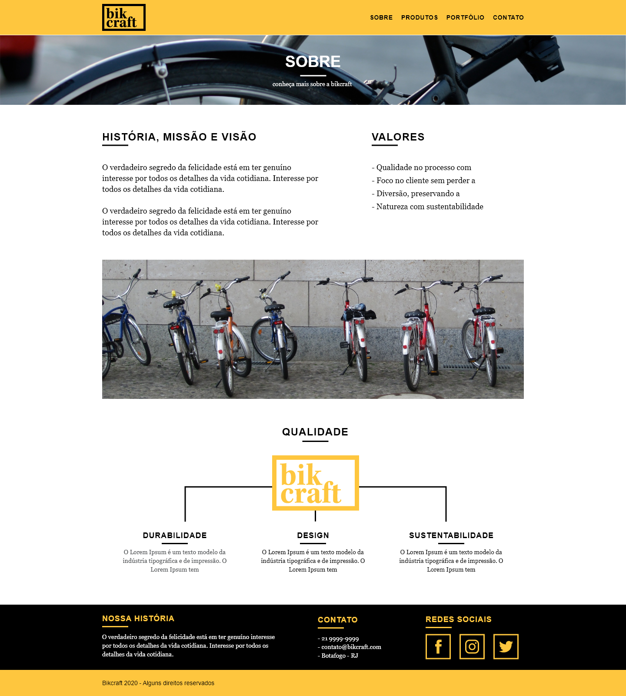
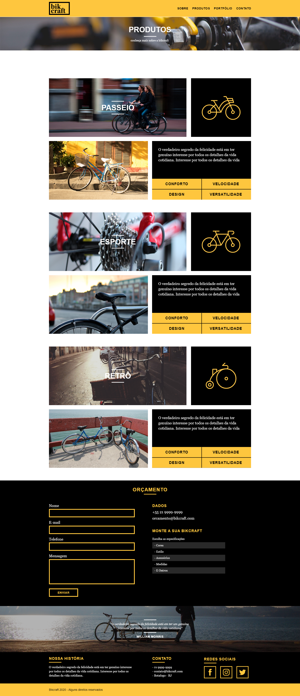
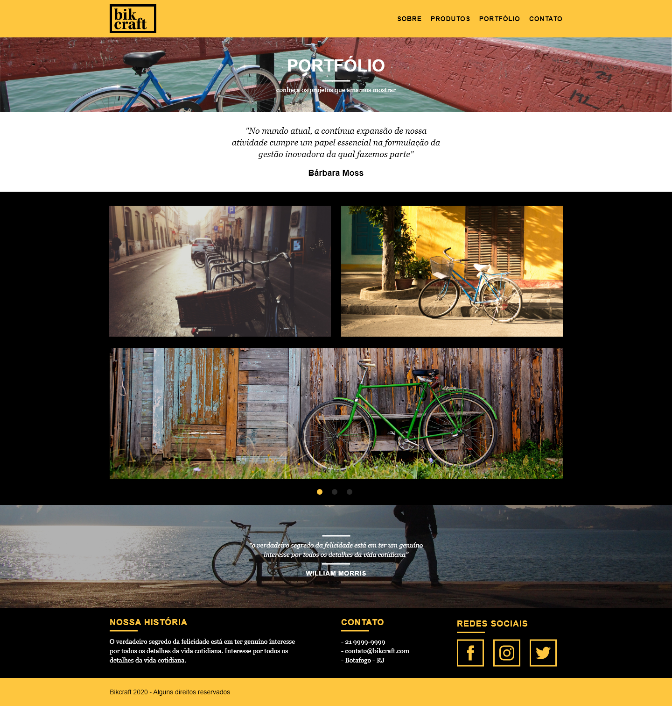
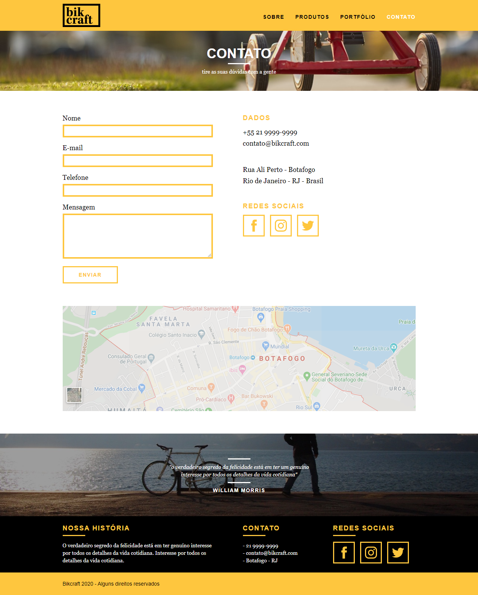

<h1 align="center">
    
</h1>

Site institucional responsivo desenvolvido durante o curso de **Web Design Completo** da [Origamid](https://www.origamid.com/curso/web-design-completo/), cuidando do layout e codificação.

A Bikcraft é uma empresa fictícia de personalização de bicicletas, cujo objetivo é aumentar seu faturamento, divulgando os produtos para novos clientes em um website.
 

## Tecnologias utilizadas:

+ HTML5
+ CSS
+ JS (animações e slides)
+ PHPMailer e SendGrid (back-end para formulários)
+ Grid (CSS e Adobe XD)

## Conceitos abordados:
+ Fundamentos do Design
+ Arquitetura da Informação e Wireframe
+ Responsividade
+ Acessibilidade e SEO

## Projeto final:

