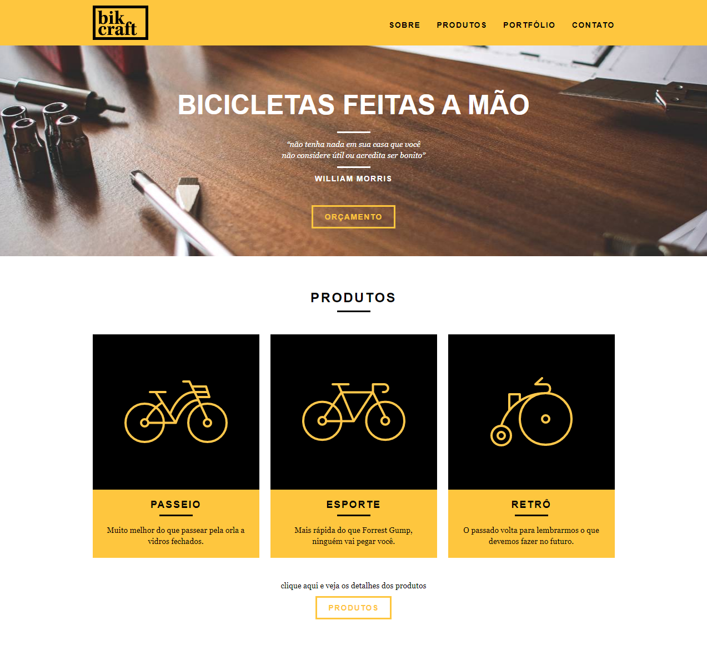

<h1 align="center">
    
</h1>

Site institucional responsivo desenvolvido durante o curso de **Web Design Completo** da [Origamid](https://www.origamid.com/curso/web-design-completo/), cuidando do layout e codificação.

A Bikcraft é uma empresa fictícia que trabalha com a personalização de bicicletas, cujo objetivo era o de aumentar seu faturamento por meio de um website, divulgando seus produtos para novos clientes.

## Tecnologias utilizadas:

+ HTML5
+ CSS3
+ JS (animações e slides)
+ PHPMailer e SendGrid (back-end para formulários)
+ Grid (CSS e Adobe XD)

## Conceitos abordados:
+ Fundamentos do Design
+ Arquitetura da Informação e Wireframe
+ Responsividade
+ Acessibilidade e SEO

## TO DO
- [ ] Implementar o sistema de blog com o CMS (Wordpress)
- [ ] Aplicar os conhecimentos de Grid Display e Flex Box

## Projeto final:
[Clique aqui](https://bikcraft.com/) para acessar o projeto no ar!

### Home

### Sobre

### Produtos

### Portfólio

### Contato

